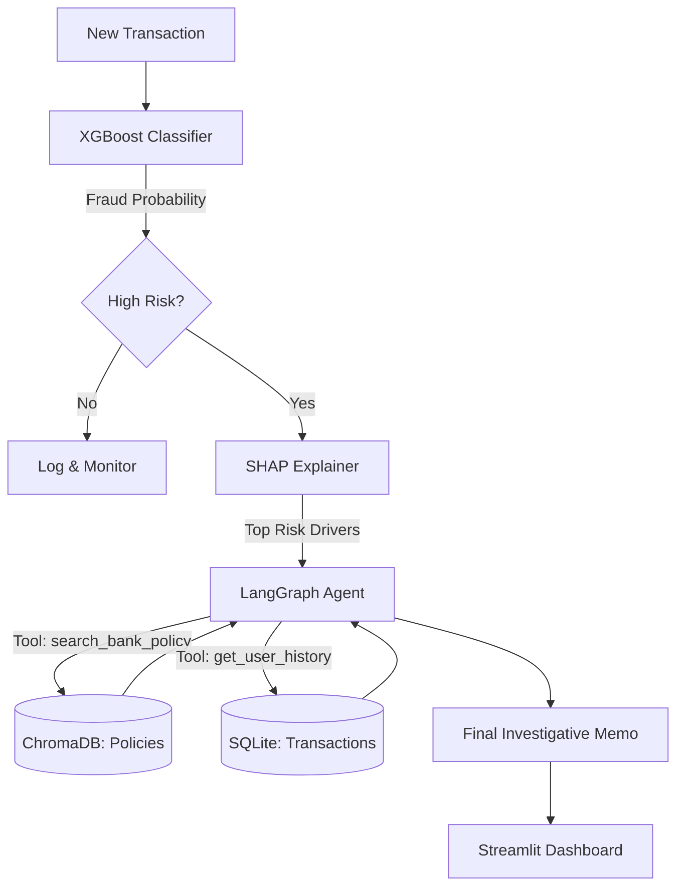

# 🛡️ Agentic XAI Fraud Investigator

An End-to-End Explainable AI System for Automated Financial Risk Oversight. This system combines machine learning precision with agentic reasoning to provide transparent, policy-aligned fraud investigations.

---

## 🚀 Overview

Traditional fraud detection models are "Black Boxes." While they may have high accuracy, human investigators often struggle to understand why a transaction was flagged, leading to high manual review times and customer friction.

**The Solution:** This project builds an Agentic AI System that doesn't just score fraud—it investigates it. By combining an **XGBoost classification engine** with **SHAP explainability** and a **LangGraph-driven LLM Agent**, the system provides a natural language investigative memo for every high-risk alert, cross-referencing internal bank policies and historical user behavior.

## 🏗️ System Architecture

The system operates in a multi-stage pipeline, ensuring both predictive accuracy and human-readable justification.



### 1. Detection & Attribution
- **XGBoost Classifier:** Optimized for highly imbalanced datasets (1% fraud rate), prioritizing recall ($F_2$ score optimization).
- **SHAP Explanation:** Decomposes the model's prediction into feature-level contributions, identifying the "Top 3" drivers for each alert.

### 2. Autonomous Investigation
- **LangGraph Agent:** A ReAct agent powered by Google Gemini (gemini-1.5-flash) that autonomously decides which investigative steps to take.
- **RAG Pipeline:** Uses ChromaDB to store and retrieve official Bank Anti-Fraud Policies, ensuring decisions are compliant.
- **Behavioral Context:** Queries a SQLite database to analyze the user's longitudinal behavior and identify anomalies.

---

## 🛠️ Tech Stack

- **ML/Math:** Python, XGBoost, Scikit-learn, SHAP
- **Agentic AI:** LangGraph, LangChain, Google Gemini Pro
- **Data/Vector:** SQLite, ChromaDB, HuggingFace Embeddings
- **Engineering:** FastAPI (Backend), Streamlit (Frontend), Docker & Docker Compose

---

## ⚙️ Installation & Setup

### Prerequisites
- Docker & Docker Compose
- Google Gemini API Key (get it from [Google AI Studio](https://aistudio.google.com/))

### Quick Start (Docker - Recommended)

1.  **Clone the Repository:**
    ```bash
    git clone https://github.com/yourusername/Explainable-AI-XAI-Fraud-Agent.git
    cd Explainable-AI-XAI-Fraud-Agent
    ```

2.  **Configure Environment Variables:**
    Create a `.env` file in the root directory:
    ```env
    GOOGLE_API_KEY=your_gemini_api_key_here
    ```

3.  **Launch the System:**
    ```bash
    docker-compose up --build
    ```

4.  **Access the Dashboard:**
    - **Frontend (UI):** [http://localhost:8501](http://localhost:8501)
    - **Backend API Docs:** [http://localhost:8000/docs](http://localhost:8000/docs)

### Manual Setup (Local Development)

If you prefer to run the components separately:

1.  **Backend:**
    ```bash
    cd Backend
    python -m venv venv
    source venv/bin/activate  # On Windows: venv\Scripts\activate
    pip install -r requirements.txt
    # Ensure GOOGLE_API_KEY is in your environment
    uvicorn main:app --reload --port 8000
    ```

2.  **Frontend:**
    ```bash
    cd Frontend
    pip install -r requirements.txt
    streamlit run app.py
    ```

---

## 📖 Usage Instructions

1.  **Select a Transaction:** Use the Streamlit sidebar to enter a Transaction ID (e.g., `TXN_00000001`) or select from the sample list.
2.  **Analyze Risk:** The dashboard will display:
    - **Fraud Probability:** The raw score from the XGBoost model.
    - **SHAP Drivers:** A chart showing exactly which factors (e.g., `device_os`, `housing_status`) pushed the risk higher.
3.  **Read the Memo:** The AI Agent will output a concise **Investigative Memo**. This memo synthesizes the model's output, the user's specific history, and relevant sections of the bank's fraud policy.
4.  **Policy Reference:** View the specific policy text that the agent used to justify its conclusion.

---

## 📸 Dashboard Preview


